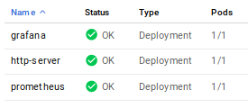
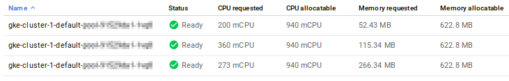
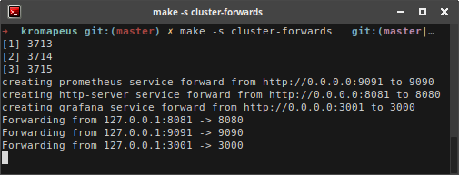
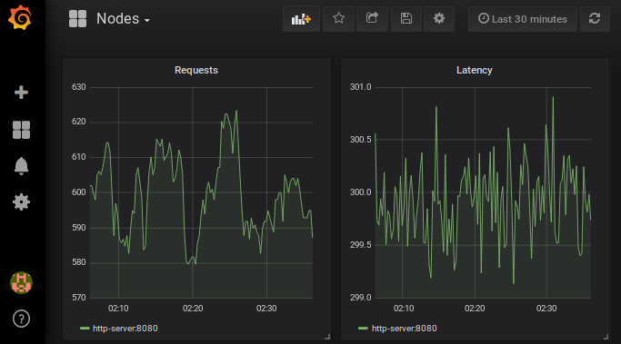
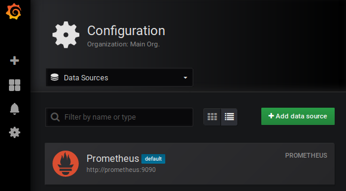
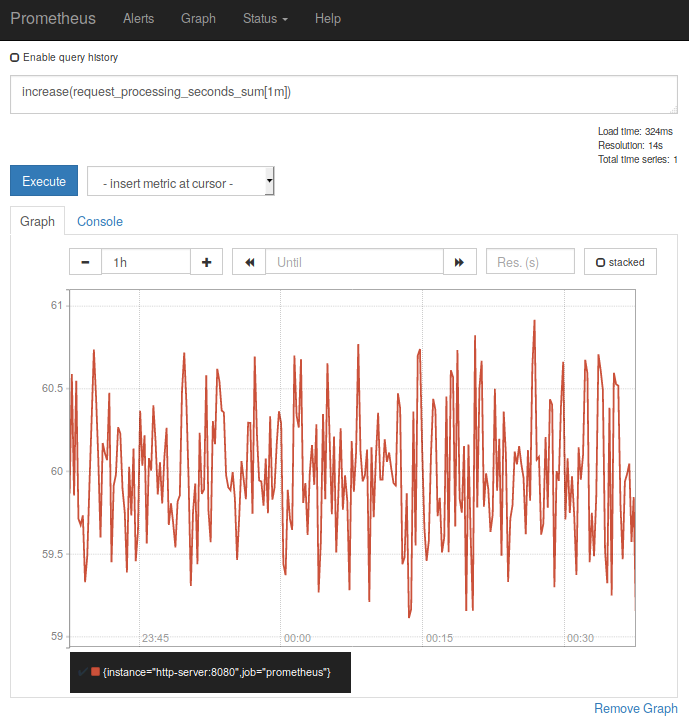
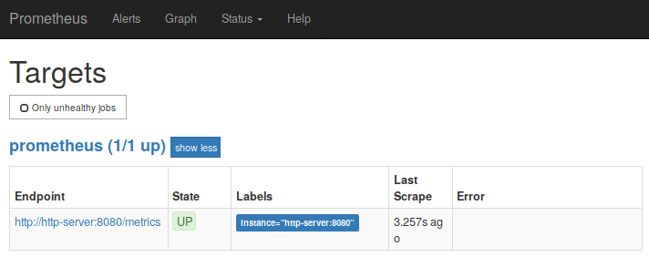

Kromapeus
=========
Kompose(Prometheus + Grafana) = Kromapeus

Kromapeus allows you to define your Grafana + Prometheus setup
in one single [docker-compose.yml](docker-compose.yml),
build and push all images to your `gcr.io` registry, and
deploy Prometheus + Grafana + you application to Kubernetes
(currently only Kubernetes engine).

Kompose Helm chart + provision cluster
--------------------------------------
You can bootstrap everything (new cluster, setup credentials,
install helm, generate chart, etc.) using `make cluster`.
For detailed steps consult the `cluster-*` and `helm-*` targets
in the [kompose.mk](kompose.mk) Makefile include.

Run locally
-----------
Alterantively run `make run` or `make up` and `make down`.
To run `docker-compose` locally. Run `make logs`, `make ping`, or
`make watch`, to monitor the setup.

Scripts
-------
The project provides some optimizations [scripts](scripts) to run
the solution on a cheap 3-node `f1-micro` cluster, leaving enough
headroom to run your app on the 3 CPUs.

Currently the setup is without public endpoints, but you can forward
all ports using `make -s cluster-forwards`.

Features
--------
The current setup is minimal. But once the local containers or GKE pods
are running you can find a preprovisioned `nodes` Dashboard.

And Prometheus is set as the default datasource.

**Note**: To save costs, the current test setup has no persistent disk (volumes).
The code is commented in [docker-compose.yml](docker-compose.yml).

Grafana runs at port 3000, and Prometheus at port 9090, which are forwarded
locally to 3001 and 9091 to avoid conflics with local ports.

